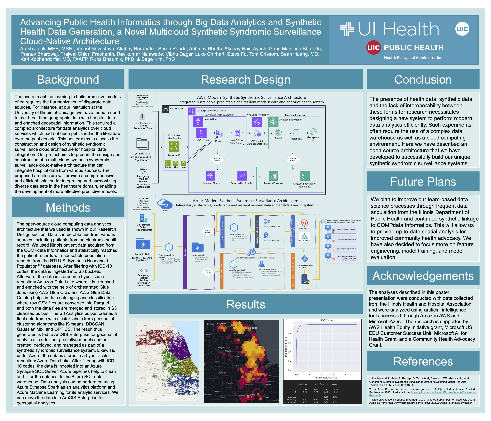

# Health-Informatics- Research Project at UIC
Analyzed the Illinois in/out patient data acquired by COMPdata informatics & statistically matched the patient records with household population records from the RTI US Synthetic Household population database.

Developed ML predictive classification model with random forest giving accuracy of 72% and recall of 78% to predict patients diagnosed with Lung cancer, Breast Cancer, Opioids-overdose etc based on ICD-10 codes.

